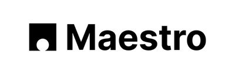
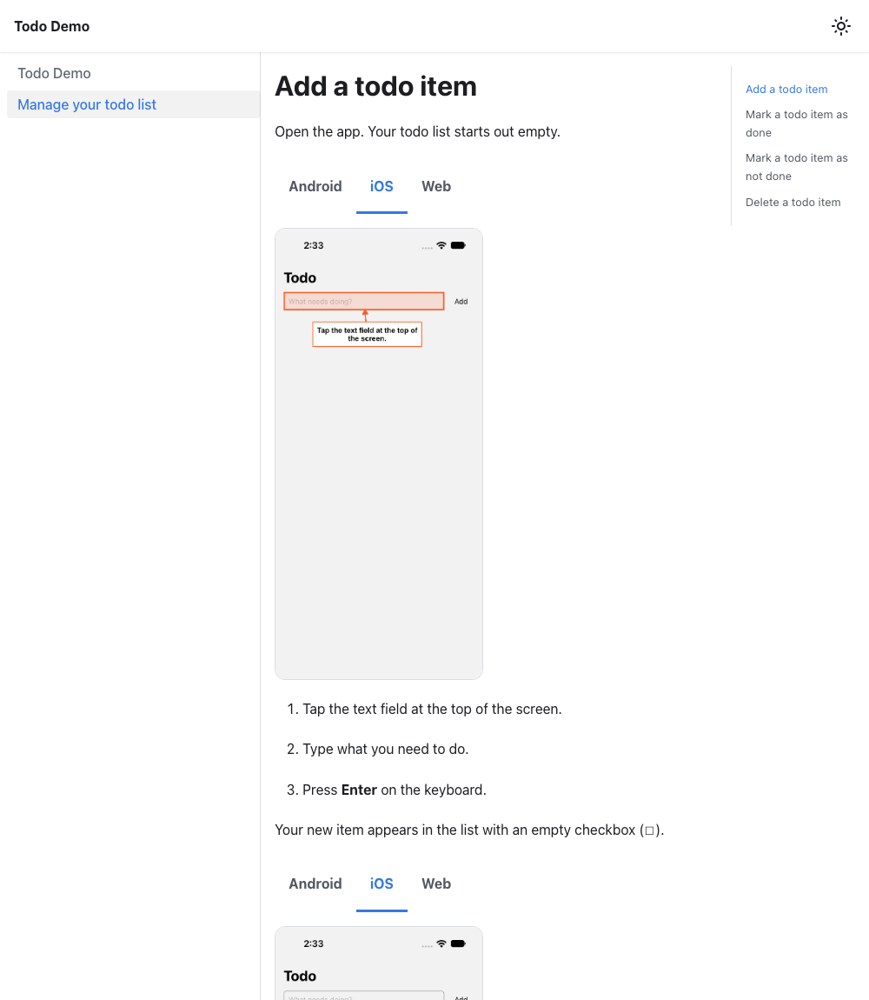

Test2Doc has always turned Playwright tests into documentation. That's great if your app lives in a browser. Less great if your users want a mobile app and think mobile websites are lame. (They're not lame, FYI. They're super dope.)

So I built `@test2doc/maestro`: a CLI that turns [Maestro](https://maestro.dev) flows into docs for Docusaurus, complete with annotated screenshots, for your Android, iOS, and web apps. It's a v0 preview, so please try to break it.
{/* truncate */}

## What's Maestro?

[Maestro](https://github.com/mobile-dev-inc/Maestro) is an open source end-to-end testing framework for mobile and web apps. You write flows in plain YAML (`- tapOn: Login`), and it drives a real emulator/simulator and web browser. It works with anything it can drive: native Android and iOS apps, React Native, Flutter, and the web.

That makes it a great fit for Test2Doc's whole idea. A flow is already a description of how to use your app, in order, verified by actually doing it.

## What you get

Here's a page generated from one flow. It's a tiny todo app that I can add to, check off, uncheck, and delete from. All your basic [CRUD operations](https://en.wikipedia.org/wiki/Create,_read,_update_and_delete). The flow ran on an Android emulator, an iOS simulator, and a browser, and they all landed on **one page** with a tab per platform.



Nobody wrote that page by hand. The steps, the warning boxes, the screenshots, and the highlighted element all came out of the flow.

## How a flow becomes documentation

Maestro doesn't have a reporter API like Playwright does, so `@test2doc/maestro` is a post-processor. You run your flows, and it reads what Maestro wrote to disk. To tell it what matters, you use something Maestro already has: `label`.

```yaml
appId: com.example.todo
name: Manage your todo list
---
- launchApp
- runFlow:
    label: Delete a todo item
    commands:
      - evalScript:
          script: ${0}
          label: |
            :::warning
            Deleting a todo item is permanent. There is no undo.
            :::
      # takes a screenshot, but only when TEST2DOC=true (see Getting started)
      - runFlow:
          file: _shared/screenshot.yaml
          env:
            NAME: delete-before
      - tapOn:
          text: Delete
          label: Tap **Delete** next to the item you want to remove.
```

- A labeled `runFlow` becomes a **section**.
- Any other labeled command becomes a **numbered step**. Commands without a label, like your assertions, stay out of the docs.
- The label on an `evalScript` is written to the page as **markdown**. That's how you get paragraphs and Docusaurus `:::tip` and `:::warning` boxes. It's just markdown. (`evalScript: ${0}` is a no-op, because Maestro has no "just text" command.)
- `takeScreenshot` becomes an **image**. Gate it on an env var so normal test runs skip it.

That flow turns into:

```md
## Delete a todo item

:::warning
Deleting a todo item is permanent. There is no undo.
:::

1. Tap **Delete** next to the item you want to remove.
```

## Highlights and annotations

If you've used the screenshot annotations in the Playwright version, these will look familiar. A screenshot highlights the elements that the labeled taps after it touch, up to the next screenshot, and each step's own words become its label. You don't write anything twice.


It's the same options as the [Playwright annotations](/docs/user-guide/screenshots/annotation): arrows, label boxes, colors, fonts, and positioning. Set your style once in a config file and every screenshot follows it:

```json title="test2doc-maestro.config.json"
{
  "annotationDefaults": {
    "showArrow": true,
    "labelBoxFillStyle": "white",
    "labelBoxStrokeStyle": "orange"
  }
}
```

```bash
npx test2doc-maestro -i android=out/android -o docs --config test2doc-maestro.config.json
```

Sizes scale with the screenshot, so one style looks right on a 500px browser window and a 1206px iPhone.

When one label lands in a bad spot, override it for just that step:

```yaml
- tapOn:
    text: Delete
    label: 'Tap **Delete** next to the item. [test2doc_annotation]:{"position":"left"}'
```


A downside: Maestro only records an element's position when it **taps** it. So only tapped elements can be highlighted, and you take the screenshot _before_ the tap, while the element is still on screen.

## One page, every platform

Run the same flow on each platform into its own folder, then hand them all to the CLI:

```bash
maestro test --platform android -e TEST2DOC=true --test-output-dir out/android .maestro
maestro test --platform ios -e TEST2DOC=true --test-output-dir out/ios .maestro
npx test2doc-maestro -i android=out/android -i ios=out/ios -o docs
```

The `--platform` matters: with an emulator and a simulator both running, Maestro picks one on its own, and you end up with Android screenshots in your iOS folder. (Ask me how I know.)

You get one page per flow, and each screenshot becomes Docusaurus tabs. If two platforms ran different flows, it refuses and tells you which ones disagree, so your docs can't quietly drift apart.

## Getting started

**1. Install Maestro.** It needs Java 17 or newer, and then it's one line:

```bash
curl -fsSL "https://get.maestro.mobile.dev" | bash
```

Windows and the rest of the details are in [Maestro's install docs](https://docs.maestro.dev/maestro-cli/how-to-install-maestro-cli). You'll also want something to run your app on: an Android emulator, an iOS simulator, or a browser.

**2. Install the CLI** in your project. It needs Node 18 or newer:

```bash
npm install --save-dev @test2doc/maestro
```

**3. Add a screenshot helper.** It's a tiny flow that only takes a screenshot when `TEST2DOC` is set, so your regular test runs stay fast and clean. Save it next to your flows, say as `.maestro/_shared/screenshot.yaml`:

```yaml
appId: com.example.app
---
- runFlow:
    when:
      true: ${TEST2DOC == 'true'}
    commands:
      - takeScreenshot: ${NAME}
```

**4. Label a flow** like the one above, call the helper with a `NAME` wherever you want a picture, and run it:

```bash
maestro test --platform android -e TEST2DOC=true --test-output-dir out/android .maestro
npx test2doc-maestro -i android=out/android -o docs
```

The pages land in `docs` as `test2doc-<flow-name>.mdx`, with their screenshots next to them. Point `-o` at your Docusaurus `docs` folder and they show up in your site. The platform tabs use Docusaurus's built-in tab components, so the classic preset already has them.

Want to see a whole project working?

- [`@test2doc/maestro` on npm](https://www.npmjs.com/package/@test2doc/maestro), and its [README](https://github.com/Null-Sweat-LLC/theDenverNexus/tree/main/packages/test2doc-maestro) with the full details
- The [demo app](https://github.com/Null-Sweat-LLC/theDenverNexus/tree/main/apps/test2doc-maestro-demo), a little React Native (Expo) todo app with its Maestro flow. It's where every screenshot in this post came from.
- The [docs generated from that demo](https://github.com/Null-Sweat-LLC/theDenverNexus/tree/main/apps/test2doc-maestro-demo-docs), a small Docusaurus site you can run yourself

The demo is React Native, but nothing in `@test2doc/maestro` is. It only ever sees what Maestro writes out.

## Why v0?

It's 0.x on purpose. Maestro doesn't promise that the files it writes stay the same from version to version, and I'm leaning on them, including a log file for element positions. iOS also reports positions in points while its screenshots are in pixels, so the CLI works out the scale from the screenshot's width (or you can give it, like `ios@3=out/ios`). Both are the kind of thing I'd like a few real projects to shake out before I call it stable.

The design notes, including what Maestro does and doesn't give you to build on, are in [the issue](https://github.com/Null-Sweat-LLC/theDenverNexus/issues/518).

If you try it, I'd love to hear how it goes. Hit me up on the [blueskies](https://bsky.app/profile/dethstrobe.bsky.social), [twitters](https://twitter.com/dethstrobe), or the [reddits](http://reddit.com/u/dethstrobe) with bugs, feedback, or a flow that makes it fall over. Those are the most useful ones.
