import Tabs from "@theme/Tabs"
import TabItem from "@theme/TabItem"

# Manage your todo list

## Add a todo item

Open the app. Your todo list starts out empty.

<Tabs groupId="platform">
  <TabItem value="android" label="Android">

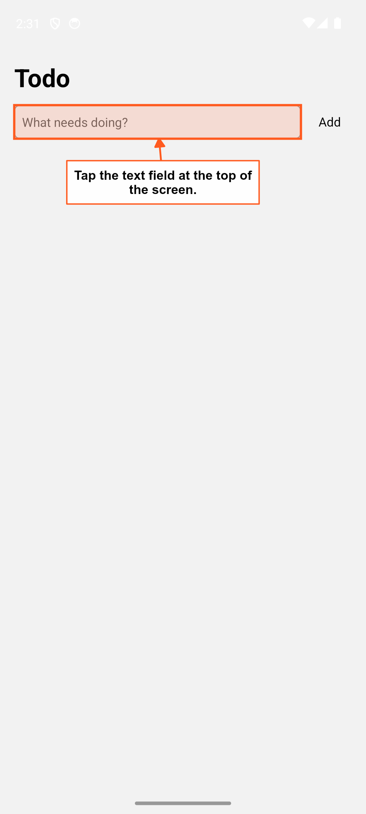

  </TabItem>
  <TabItem value="ios" label="iOS">

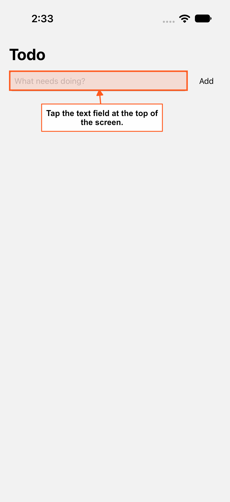

  </TabItem>
  <TabItem value="web" label="Web">

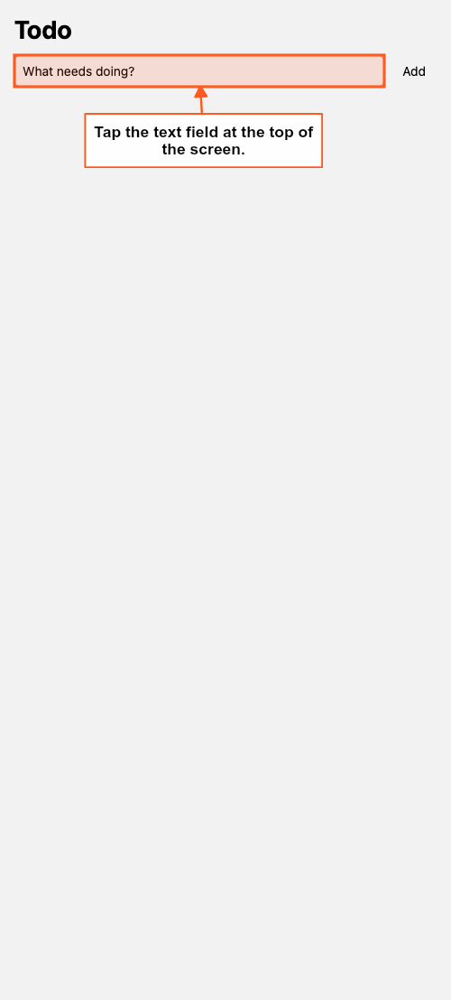

  </TabItem>
</Tabs>

1. Tap the text field at the top of the screen.

2. Type what you need to do.

3. Press **Enter** on the keyboard.

Your new item appears in the list with an empty checkbox (☐).

<Tabs groupId="platform">
  <TabItem value="android" label="Android">

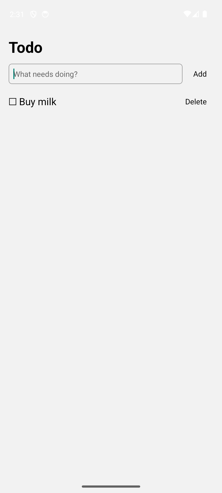

  </TabItem>
  <TabItem value="ios" label="iOS">

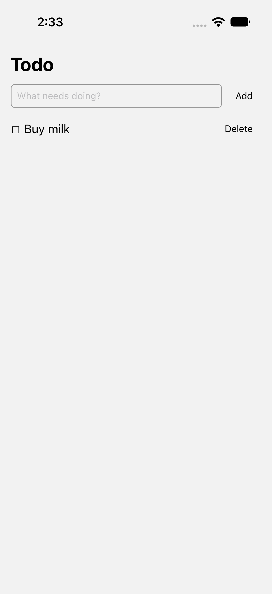

  </TabItem>
  <TabItem value="web" label="Web">

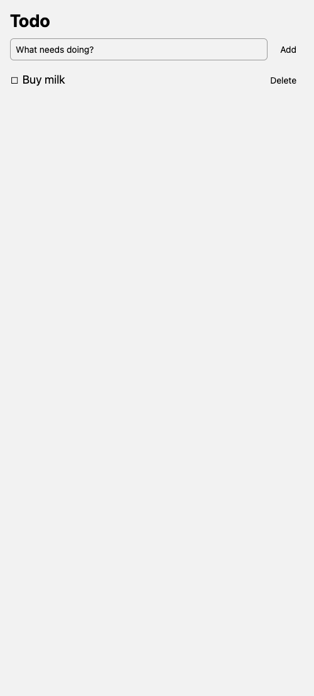

  </TabItem>
</Tabs>

:::tip
Repeat these steps to add as many items as you like.
:::

## Mark a todo item as done

<Tabs groupId="platform">
  <TabItem value="android" label="Android">

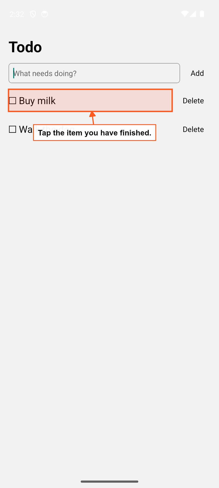

  </TabItem>
  <TabItem value="ios" label="iOS">

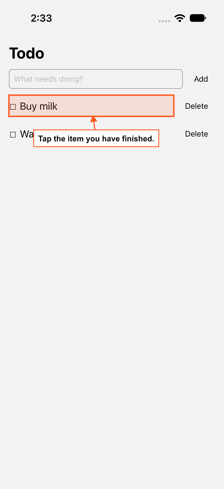

  </TabItem>
  <TabItem value="web" label="Web">

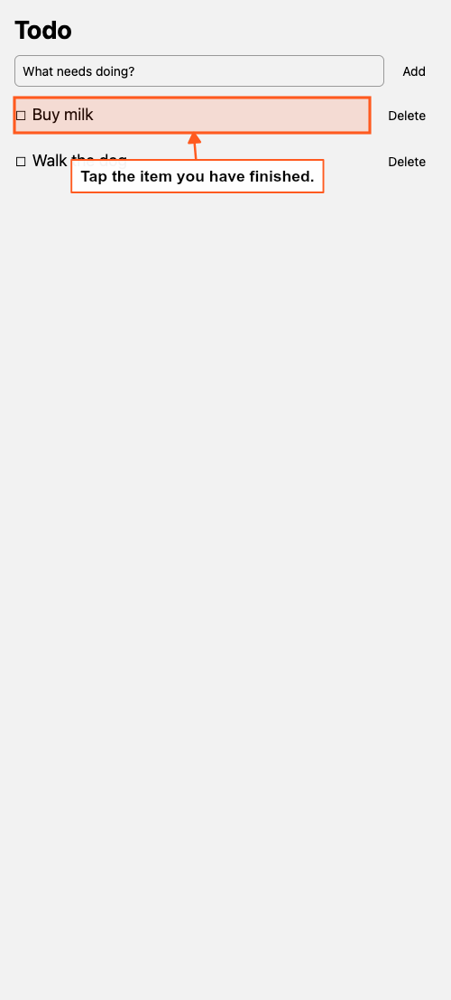

  </TabItem>
</Tabs>

1. Tap the item you have finished.

The checkbox is now checked (☑).

<Tabs groupId="platform">
  <TabItem value="android" label="Android">

  </TabItem>
  <TabItem value="ios" label="iOS">

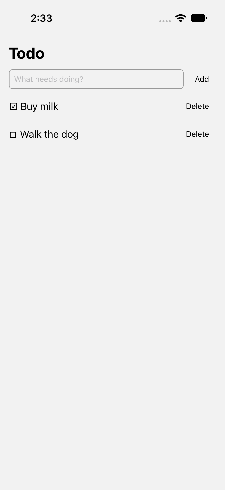

  </TabItem>
  <TabItem value="web" label="Web">

  </TabItem>
</Tabs>

## Mark a todo item as not done

<Tabs groupId="platform">
  <TabItem value="android" label="Android">

  </TabItem>
  <TabItem value="ios" label="iOS">

  </TabItem>
  <TabItem value="web" label="Web">

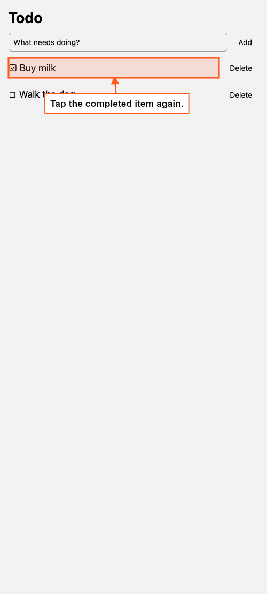

  </TabItem>
</Tabs>

1. Tap the completed item again.

The checkbox is empty again and the item is back on your list.

<Tabs groupId="platform">
  <TabItem value="android" label="Android">

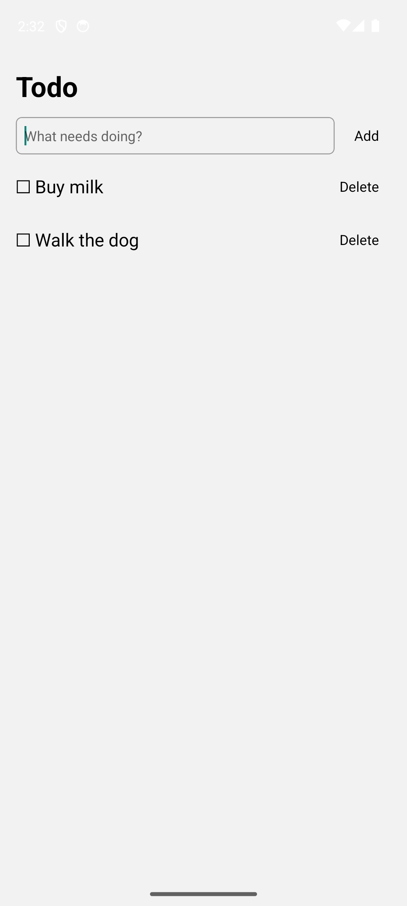

  </TabItem>
  <TabItem value="ios" label="iOS">

  </TabItem>
  <TabItem value="web" label="Web">

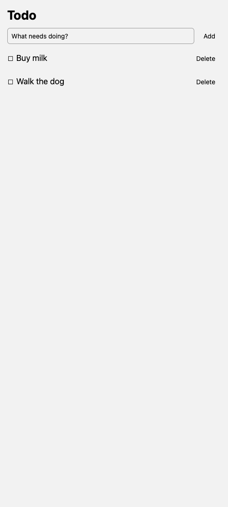

  </TabItem>
</Tabs>

## Delete a todo item

:::warning
Deleting a todo item is permanent. There is no undo.
:::

<Tabs groupId="platform">
  <TabItem value="android" label="Android">

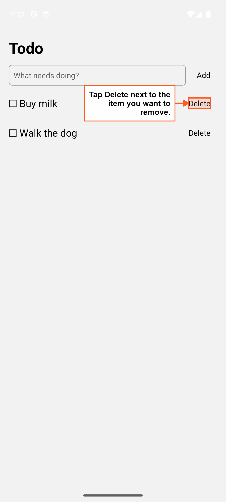

  </TabItem>
  <TabItem value="ios" label="iOS">

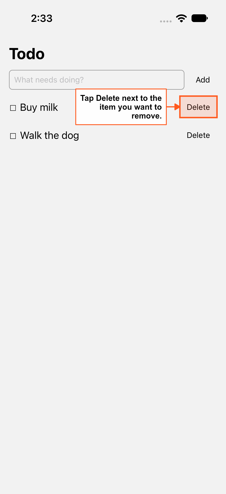

  </TabItem>
  <TabItem value="web" label="Web">

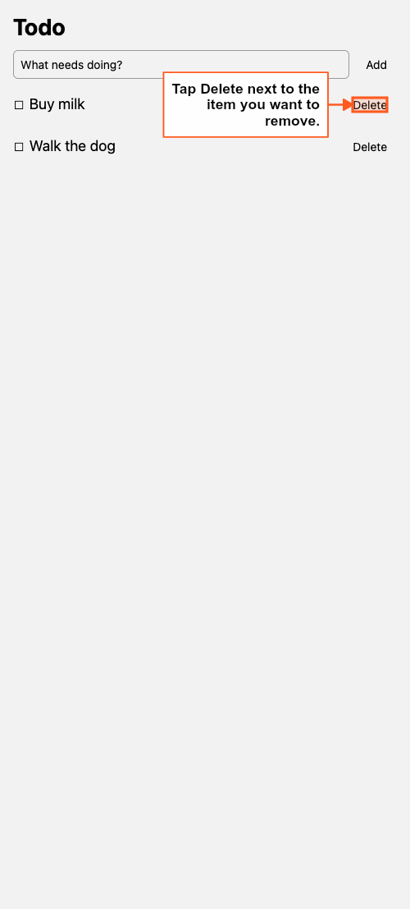

  </TabItem>
</Tabs>

1. Tap **Delete** next to the item you want to remove.

The item is removed and the rest of your list stays as it was.

<Tabs groupId="platform">
  <TabItem value="android" label="Android">

  </TabItem>
  <TabItem value="ios" label="iOS">

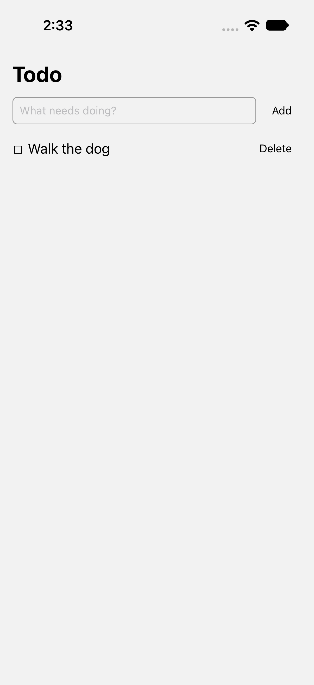

  </TabItem>
  <TabItem value="web" label="Web">

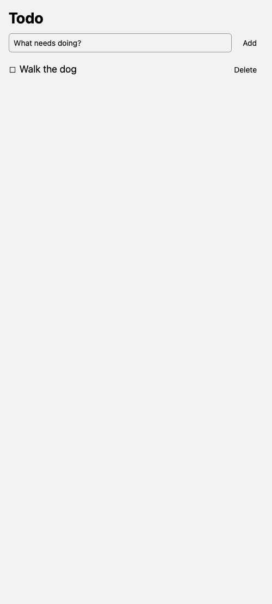

  </TabItem>
</Tabs>

